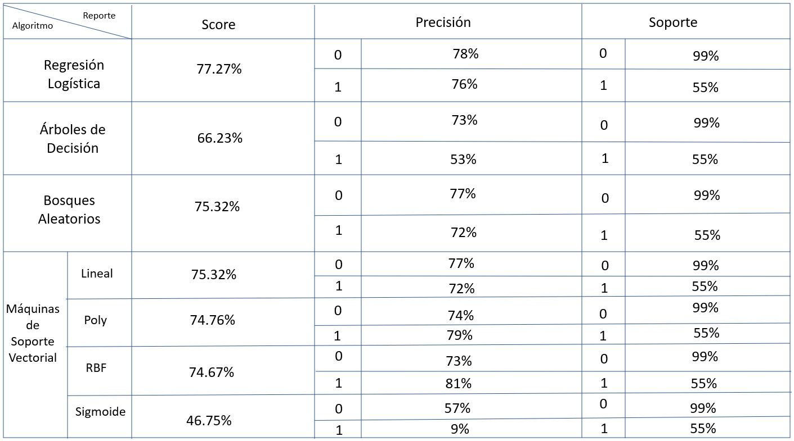

<h1 align="center"> Modelos de Clásificación </h1>
<h2 align="center"> Regresión Logística | Árboles | Bosques | SVM </h2>

Se aplican diferentes modelos de clasificación en un conjunto de datos sobre estudios clínicos de diabetes con el propósito de clasificar si Ua persona tiene diabetes o no. Dentro de los modelos se ncuentra la regresión logística, árboles de decisión, bosques leatorios y máquinas de soporte vectorial. Se obtuvo cada no de los modelos anteriores, se realizó una validación.
Una de las grandes ventajes de la minería de datos está en su diversidad y aplicación de disntitos algoritmos a un mismo problema. La elección del mejor algoritmo para una tarea analítica específica puede ser un desafío. Aunque puede usar diferentes algoritmos para realizar la misma tarea, cada uno de ellos genera un resultado diferente, y algunos pueden generar más de un tipo de resultado.

### **Contexto**
Caso de estudio

Estudios clínicos de diabetes en una población femenina.

Objetivo. Clasificar si una persona tiene diabetes o no, en función de otros parámetros disponibles, como número de embarazos, glucosa, presión arterial, índice de masa corporal, los niveles de insulina, entre otros. Se requiere obtener el mejor modelo de aprendizaje automático para predecir la diabetes.

### **Conclusiones**
Es importante elegir un algoritmo y sino hasta emplear más de uno con la finalidad de obtener mejores resultados para conseguir nuestro objetivo. Al finalizar la aplicación de los algoritmos se puede concluir que la regresión logística es la nos ofrece mayor exactitud, mientras la SVM es la que nos ofrece un peor resultado esto debido a que es una función logarítmica y al aplicarla a nuestros datos que son linealmente separables nos ofrece un peor resultado.Por otro lado al usar bosques y haciendo una poda se pudo aumentar el porcentaje de exactitud convirtiéndolo en el segundo algoritmo con mejor % de exactitud. 
Cabe mencionar, si se quisieran mejorar los modelos será necesario equilibrar los datos con los que se cuenta, es decir, el número de personas con diabetes y que no tienen diabetes deberá ser aproximadamente el mismo. Como se observó en la parte de “acceso de datos” al momento de realizar el conteo, se obtuvo que aproximadamente el 35% de las personas no tiene diabetes mientras que el porcentaje restante sí. Sin duda al analizar una situación hay que tener en cuenta diversos factores como: tipo de datos que estudias, aplicar algún proceso para limpiar datos, quitar datos faltantes, datos atípicos, elegir adecuadamente  el algoritmo/os a implementar, entre otras cosas.

  

**Link:**
https://www.kaggle.com/saurabh00007/diabetescsv
